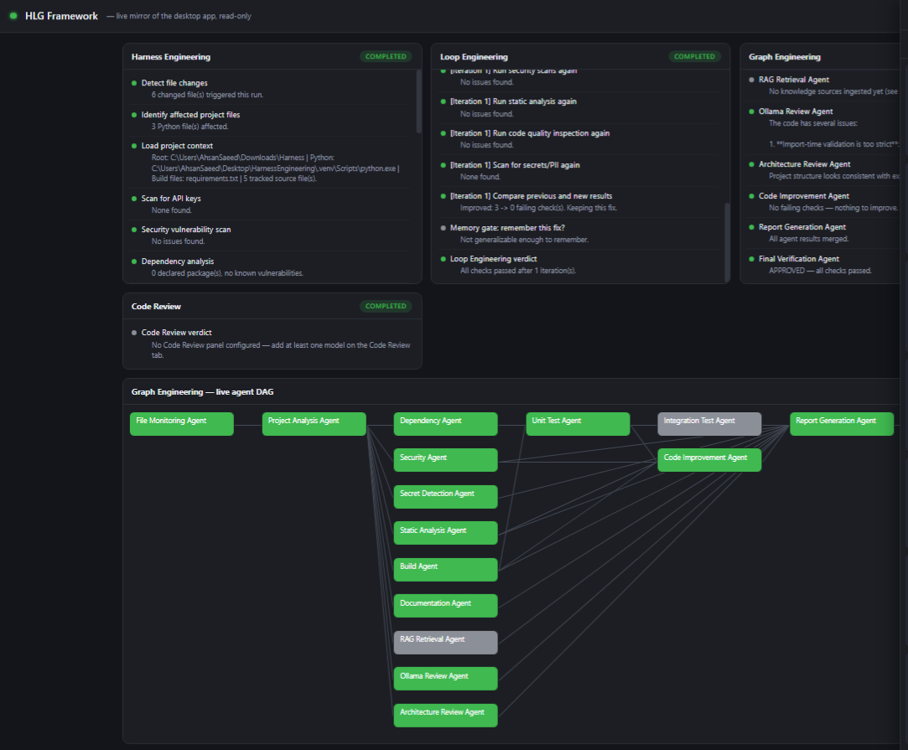
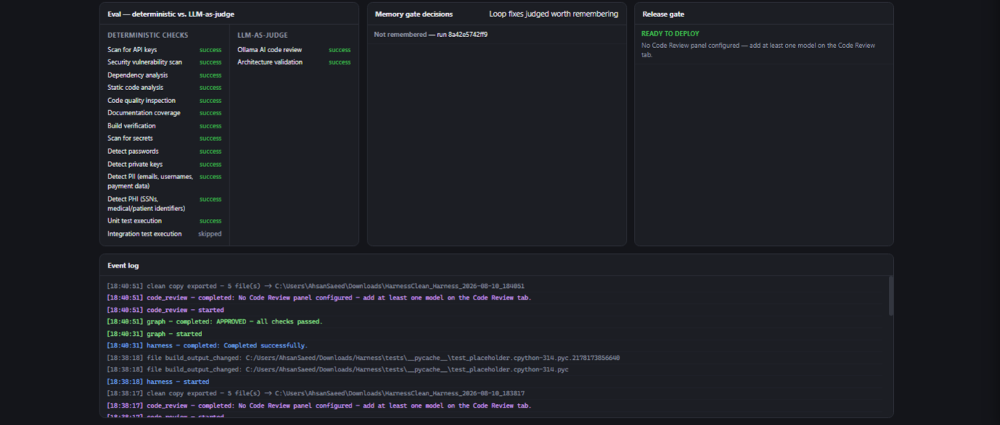
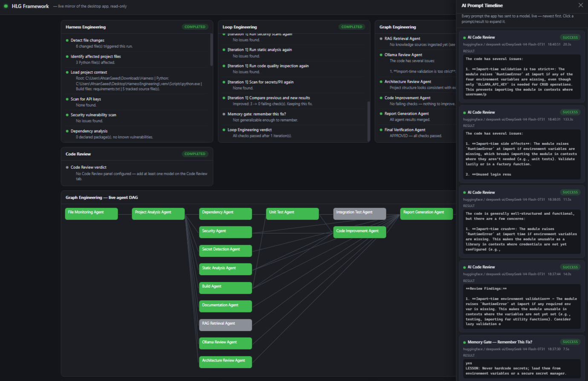

# HLG Framework

**H**arness / **L**oop / **G**raph Engineering — a local Windows desktop app
(PySide6) plus a live browser mirror that watches Python projects and
automatically runs AI-assisted verification, an autonomous fix loop, and a
concurrent multi-agent review. It lives in the system tray and re-analyzes
just the files you change, not the whole project, on every save.

Every pipeline can use **local Ollama** (fully offline), **Ollama's own
cloud models** (`ollama.com`, same API, one extra key), or a cloud provider
(Google Gemini, OpenAI, Anthropic, HuggingFace) — pick a Provider + Model
right on each tab, type to search/filter, or set one **Auto Run** toggle and
let it run itself. If a configured model fails at call time, the app
automatically retries through the next configured, working provider and
keeps using it — no manual reconfiguration.

## Screenshots

The live web mirror mid-run — Harness, Loop, and Graph Engineering all
completed, the Graph DAG's agents all green, Code Review waiting on a
configured panel:



Add more PNGs to `docs/Images/` (or `docs/screenshots/`) and reference them
the same way — e.g. ``.

## What this app actually does

Point it at a Python project folder and it watches that folder. Every time
you save a file, it automatically:

1. **Checks it** (Harness Engineering) — secrets, security, style, build,
   tests, an AI review, and more.
2. **Fixes what it can** (Loop Engineering) — if something's wrong and Auto
   Run is on, it asks a model for a fix, applies it safely, and re-checks.
3. **Re-verifies everything concurrently** (Graph Engineering) — the same
   checks as a multi-agent graph, running independent checks in parallel.
4. **Reviews the diff** (Code Review) — one or more models independently
   compare the result against the last known-good version, watching for
   silent regressions a fix might have introduced.
5. **Exports a clean copy** to your Downloads folder once everything is
   green, and tells you plainly: 100% passed.

If it can't get all the way there — a model isn't configured, a fix genuinely
isn't working after several tries, or (with Auto Run off) it's waiting on you
— it stops and says exactly why, instead of pretending to be done.

New to the concepts? Open the **How It Works** tab in the app — it explains
Harness/Loop/Graph in plain terms, grounded in this app's own real pipeline,
with a live status strip so you can watch it happen instead of just reading
about it.

## The four engines, chained automatically

- **Harness Engineering** — a 21-step check (independent steps run
  concurrently): secret/API-key/password/private-key scanning, PII (emails,
  usernames, payment card numbers) and PHI-adjacent (SSNs, patient/medical
  record identifiers) detection, dependency and static analysis, a security
  scan, build verification, unit/integration tests, an AI code review, RAG
  knowledge retrieval, an architecture check, and a generated report. Runs on
  every save.
- **Loop Engineering** — on failure, asks your configured model for a fix
  (streamed live, token by token, for Ollama). With **Auto Run off**, you
  review each proposed file individually — Accept some, Reject others, in
  the same round — before anything is written (backed up first, and rolled
  back automatically if it didn't actually help). With **Auto Run on**,
  fixes apply immediately, no prompts, and it keeps retrying for as long as
  each attempt is genuinely improving things — it only gives up once several
  attempts in a row show zero improvement (a real stall), not after a fixed
  try count. This includes secret/PII/password findings: with Auto Run on,
  Loop fixes them by moving the value to an environment variable (never by
  masking or renaming it to dodge the scanner); with Auto Run off, the same
  finding blocks immediately with the exact file/line, for you to review by
  hand. Missing project scaffolding (`tests/`, `requirements.txt`,
  `README.md`) is generated deterministically — no model call needed for
  that part.
- **Graph Engineering** — the same checks as a multi-agent DAG, executed
  with real concurrency via a router/orchestrator. Runs automatically once
  Harness (and Loop, if it ran) passes, and if it fails on something fixable,
  it feeds back into the same Loop retry cycle instead of just stopping.
- **Code Review** — the final gate, once Graph Engineering passes. Every
  model you've added to the Code Review tab's panel independently compares
  the current code against the project's last known-good baseline, looking
  for anything that was accidentally removed, broken, or silently changed —
  not style opinions or intentional fixes. If any reviewer flags a real
  regression, the whole Harness → Loop → Graph chain restarts automatically
  (with Auto Run on) instead of exporting code that just regressed. Once
  every reviewer agrees it's clean, it says so and moves on to export.



With **Auto Run on**, the whole chain — Harness, Loop, Graph, Code Review —
keeps retrying and re-chaining automatically, stall-tracked at every stage,
until it reaches a genuinely clean, passing state or gives up with a clear,
evidence-based reason (not a stale "Failed" left over from an earlier round).
Once every stage is green, the Dashboard and Eval tabs show a plain
**"✅ 100% PASSED"** banner and the clean copy is exported. With **Auto Run
off**, every write — and every Code Review regression — asks first.

## Reliable by design, not by luck

- **No fake success.** Every pass/fail is backed by a real tool run (pytest,
  ruff, pip-audit, a real build/compile) — never a model's self-report. An AI
  opinion (the code review, architecture check) is shown as a finding, never
  substituted for evidence.
- **Stall detection, not arbitrary limits.** Retries continue as long as
  they're working; they stop only once progress genuinely flatlines,
  reported with the actual reason (which check, how many rounds).
- **Automatic model fallback.** If a configured provider/model errors out at
  call time, the app retries through the next configured, working provider,
  persists the switch for that pipeline going forward, and shows it plainly
  in the AI Prompt Timeline as an "(auto-fallback)" — never silent.
- **Backups before every write.** Loop backs up every file it's about to
  change and rolls back automatically if a fix didn't actually help.
- **Security findings are never silently masked.** A real secret/PII finding
  either gets a genuine fix (moved to an environment variable, re-verified)
  under Auto Run, or blocks with the exact location for you to handle by
  hand — never quietly ignored either way.

## AI Prompt Timeline

Every single model call the app makes — Harness's AI code review, Loop's
fix generation, Graph's agents, Code Review's panel, the memory gate, and
any automatic provider fallback — passes through one shared facade, which
means every one of them is observable. The **live web mirror** (below) shows
them in a collapsible right-hand drawer: agent name, provider/model, live
"running" status, elapsed time, and the actual prompt and result text,
expandable per entry. Nothing is hidden — if you want to know exactly what
the app just asked a model to do and what it got back, it's there in real
time.

## Live web mirror

On startup, the app opens a **live, read-only mirror of itself in your
browser** (`http://127.0.0.1:8765` by default) — the same Harness/Loop/Graph/
Code Review events, animated in real time, plus the AI Prompt Timeline above,
so you can watch the whole system work without the desktop window in focus.
Disable it or change the port in Settings; reopen it any time from the
**Dashboard** tab's "Open in Browser" button.

See [`docs/HARNESS_LOOP_GRAPH_DEFINITIONS.md`](docs/HARNESS_LOOP_GRAPH_DEFINITIONS.md)
for exactly which parts of this naming come from Anthropic's harness-design
article and which are this project's own design — that distinction is kept
explicit rather than implied.

## Skills (`HARNESS.md`)

Drop a `HARNESS.md` at a project's root (or use the "Open/Create HARNESS.md"
button on the Harness tab) to write standing project-specific standards and
context once — it's automatically prepended to every AI code review, fix,
and improvement-suggestion prompt for that project, no re-explaining needed
on every run. See [`docs/HARNESS_LOOP_GRAPH_DEFINITIONS.md`](docs/HARNESS_LOOP_GRAPH_DEFINITIONS.md#skills-harnessmd)
for where this concept comes from and how it differs from RAG.

## Model providers

| Provider                    | Needs a key?                           | Notes                                                                                                                                                           |
| --------------------------- | -------------------------------------- | --------------------------------------------------------------------------------------------------------------------------------------------------------------- |
| Ollama (Local)              | No                                     | Talks to your local Ollama server (`127.0.0.1:11434` by default) — fully offline. Shows whatever `ollama list` shows on this machine.                      |
| Ollama (Remote / Cloud API) | Yes (from`ollama.com/settings/keys`) | Calls`https://ollama.com` directly with your key — separate from `ollama signin` in a terminal, which only affects the Local provider's `:cloud` models. |
| Google Gemini               | Yes                                    |                                                                                                                                                                 |
| OpenAI                      | Yes                                    |                                                                                                                                                                 |
| Anthropic                   | Yes                                    |                                                                                                                                                                 |
| HuggingFace                 | Yes (for chat; search is public)       | Type any name in the model box to search the Hub live; gated-repo notices are informational once you've accepted a model's license.                             |

Every provider/model dropdown supports typing to filter — live search for
HuggingFace, instant local filtering of the already-fetched list for
everything else. Pick per-pipeline: Harness review model, Loop fix model,
Graph review model, RAG embedding model, and an independent multi-model
Code Review panel.

## Also included

A live Dashboard (CPU/memory, queue/job counts, security and quality
scores, overall health, the 100% PASSED release banner); a **How It Works**
tab that explains the whole system in plain language with a live status
strip; an Issue Sidebar that classifies any failed step and can jump
straight to the file:line in VS Code; a local RAG knowledge base fed by
files, folders, websites, or git repos; a **Memory** tab covering semantic
(RAG + memory-gate lessons), episodic (run history), and procedural
(installed plugin steps) memory; an **Eval** tab splitting every check into
deterministic (pytest/ruff/pip-audit) vs. LLM-as-judge, plus the release
gate; JSON/HTML/PDF reports with run history; desktop notifications; a
plugin extension point; and an optional Windows autostart toggle.

## Quick start

```
run.bat
```

See [`docs/INSTALL.md`](docs/INSTALL.md) for prerequisites and first-run
steps, [`docs/TESTING_GUIDE.md`](docs/TESTING_GUIDE.md) to verify Harness,
Loop, and Graph yourself against a small example project with two
intentional issues, and [`docs/ARCHITECTURE.md`](docs/ARCHITECTURE.md) for
how the code is organized and how to extend it.

## Current scope

This build's first pass gives **Python projects** full, real integration
(pytest, ruff, pip-audit, compileall) end-to-end across all three panels.
Other language ecosystems have a documented extension seam
(`docs/ARCHITECTURE.md` → "Extending the app") but no adapter yet.

[`docs/AI_ORCHESTRATION_GAP_ANALYSIS.md`](docs/AI_ORCHESTRATION_GAP_ANALYSIS.md)
maps what's already solid against a much larger "one prompt, full autonomous
orchestration" target architecture (a dynamic per-task planner, conditional
RAG, web/deep research, tool auto-discovery, multi-project isolation, and
more) — the honest, cited state of what exists today vs. what's still
greenfield, and a recommended build order for what's next.

## Tests

```
pytest tests/
```

## Developer

Ahsan Saeed
